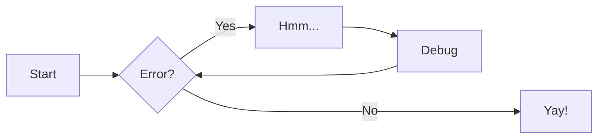
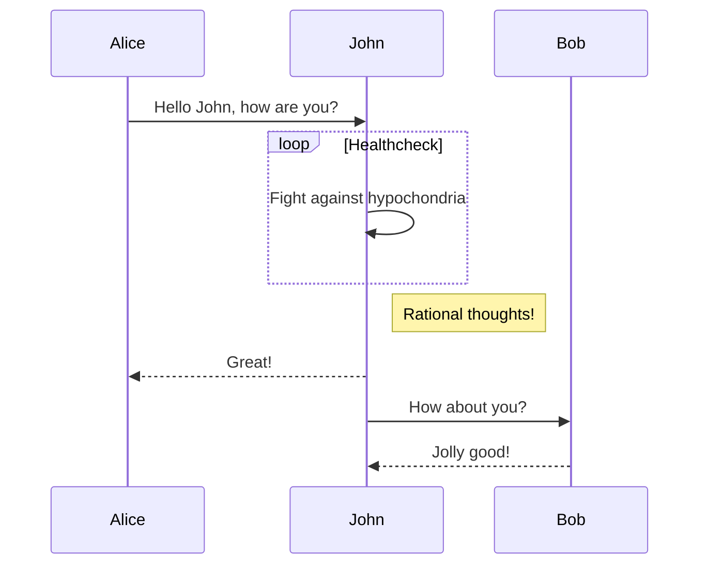
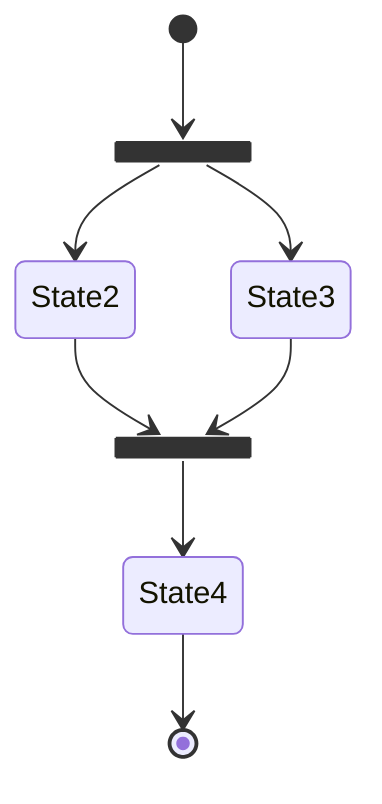
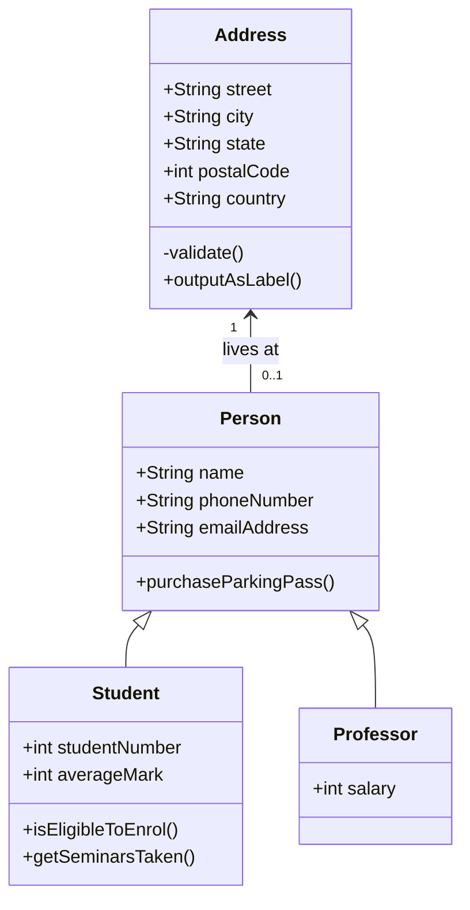
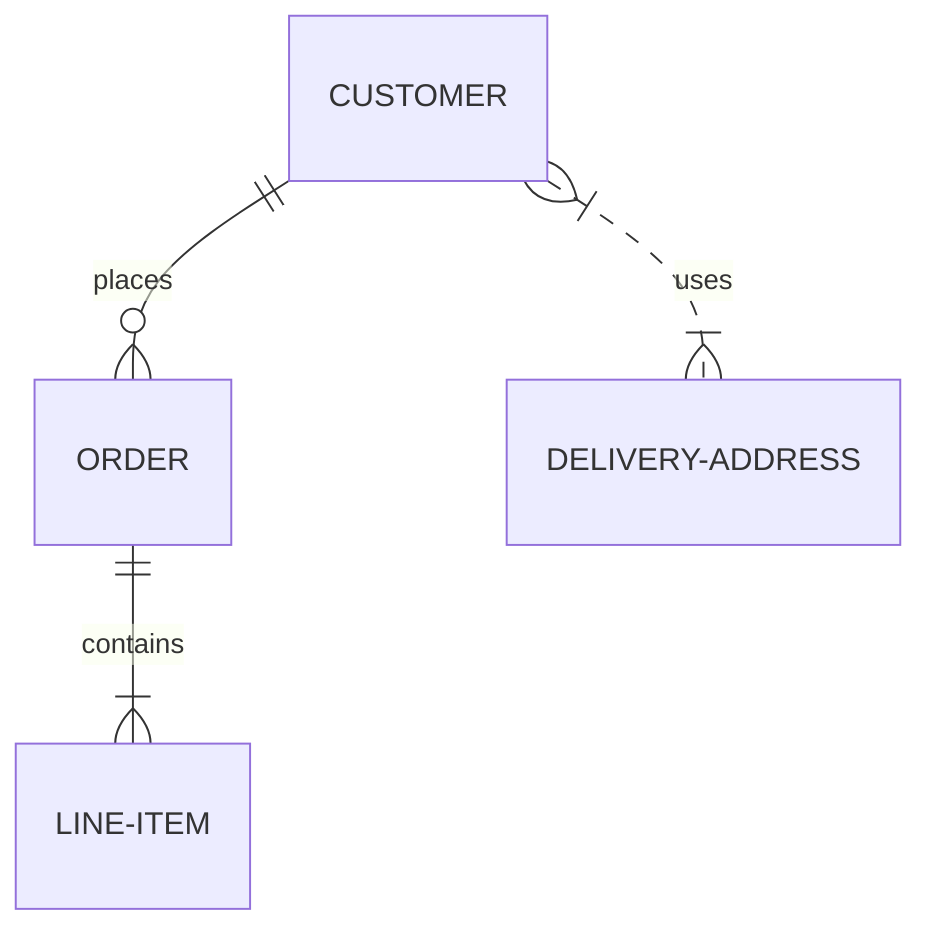

---
tags:
    - 文档站
---

# 文档站使用说明

- 本产品文档站采用了 Mkdocs 开发的 Material 主题.
- 支持文档语法为 Markdown

## 文档站结构

!!! important 文档站结构

    文档内容全部存放在 `docs/` 目录下，修改内容仅编辑 `docs/` 目录下的文件即可

```sh
docs
├── .pages.yaml     # 站点顶部导航配置文件，控制顺序和名称，一般不增加
├── README.md       # 默认情况下 目录下 README.md 作为 default 页面
├── SUMMARY.md
├── dce5.0          # 子文件夹，支持多级目录，自动检测配置
│   ├── 01kpanda.md # 子文件自动检测，可以通过文件名前缀数字控制排序
│   ├── 02ghippo.md
│   ├── 03clusterpedia.md
│   ├── ...
├── design
│   ├── .pages.yaml # 可以不创建 当需要对一个目录进行特殊配置时引入.pages.yaml
│   ├── README.md
│   ├── ...
├── images          # 图片文件夹，使用相对路径引入即可
│   ├── ghippo.png
│   ├── icon.png
│   ├── ...
├── products
│   ├── README.md
│   ├── ...
├── scaffolds       # 这里存放模板文件，一般不需要修改
│   ├── .pages.yaml	# 特殊处理，增加 hide:true 不展示在顶层 nav
│   └── tags.md
├── stylesheets     # 基于主题的自定义样式，一般不需要修改
│   └── extra.css
├── support
│   ├── 01-mkdocs-material.md
│   ├── README.md
│   ├── ...
└── survey
    ├── README.md
    ├── ...
```

### `.pages.yaml` 介绍

通过对每个文件下的特定处理，默认情况下 `.pages.yaml` 为空即可，如需要特殊处理，可以在文档添加下方参数

```yaml
title: Products     # 文件夹展示的标题
order: 1            # 文件夹的顺序，数字越小越靠前
hide: false         # 是否隐藏，默认不隐藏
nav:                # 采用自定义导航
    - filename.md
    - filename2.md
    - ...
```

> `nav` 的配置方式，还有更多高级用法，可以参考插件做的的 Github 介绍 [传送门](https://github.com/lukasgeiter/mkdocs-awesome-pages-plugin#customize-navigation)

### 如何添加一篇文档

    1. 在 `docs/` 目录下创建一个文件夹，如 `dce5.0`
    2. 或者在 `docs/` 目录下创建一个文件，如 `01kpanda.md`
    3. 完成对文档的编写
    4. 推送此变更到 gitlab , 一般 2 分钟后，其他人就可以在文档站上看到

### Front Matter

通过在文档的头部 增加对应的 Front Matter，可以设置文档的标题、描述、标签、额外的配置等

本文档采用了 Tag 的组件，可以进行文档的 全站关联，比如：

```yaml
tags:
    - HowTo

```

### Code Highlighting

```python
import pandas

df = panda.read_csv('data.csv')
df.head()


def wait_callback(df):

    if df:
        print('ok')
    else:
        print('no')
    
    for i in range(10):
        print(i)

    print(df)
```


还可以使用的参数：

- title: 用来定义文档的标题，如果未定义 Mkdocs 会默认采用 文档内第一个 `#` 作为标题


## Markdown 语法介绍

在基础的 Markdown 语法之外，`Material` 风格支持以下语法 `Obsidian` 可以和 `Material` 有很好的兼容，安装对应的插件即可


### 快捷传送门

Lorem ipsum[^1] dolor sit amet, consectetur adipiscing elit.[^2]

### Video

- video from youtube

<div class="responsive-video-container">
    <iframe src="https://streamable.com/e/yslhdu" allowfullscreen></iframe>
</div>

- video from bilibili

<div class="responsive-video-container">
<iframe src="//player.bilibili.com/player.html?aid=470390464&bvid=BV1sT41137m6&cid=758894410&page=1" scrolling="no" border="0" frameborder="no" framespacing="0" allowfullscreen="true"></iframe>
</div>

### Inner Table

=== "C"

    ``` c
    #include <stdio.h>
    
    int main(void) {
      printf("Hello world!\n");
      return 0;
    }
    ```

=== "C++"

    ``` c++
    #include <iostream>
    
    int main(void) {
      std::cout << "Hello world!" << std::endl;
      return 0;
    }
    ```

### Annotations

!!! note "与 Obsidian 结合使用"

    在 Obsidian 内安装三方插件,点击右侧按钮唤醒 Obsidian [Admonition](obsidian://show-plugin?id=obsidian-admonition)


!!! info "这里可以写标题"

	如何编写：在文档新行 起始位置输入`!!! +[info]` 标记；然后2 个回车，中间空一行，第三行开始编写具体内容


!!! note "Phasellus posuere in sem ut cursus"

    Lorem ipsum dolor sit amet, consectetur adipiscing elit. Nulla et euismod
    nulla. Curabitur feugiat, tortor non consequat finibus, justo purus auctor
    massa, nec semper lorem quam in massa.


!!! abstract "Phasellus posuere in sem ut cursus"

    Lorem ipsum dolor sit amet, consectetur adipiscing elit. Nulla et euismod
    nulla. Curabitur feugiat, tortor non consequat finibus, justo purus auctor
    massa, nec semper lorem quam in massa.


!!! todo "Phasellus posuere in sem ut cursus"

    Lorem ipsum dolor sit amet, consectetur adipiscing elit. Nulla et euismod
    nulla. Curabitur feugiat, tortor non consequat finibus, justo purus auctor
    massa, nec semper lorem quam in massa.

!!! info "Phasellus posuere in sem ut cursus"

    Lorem ipsum dolor sit amet, consectetur adipiscing elit. Nulla et euismod
    nulla. Curabitur feugiat, tortor non consequat finibus, justo purus auctor
    massa, nec semper lorem quam in massa.

!!! success "Phasellus posuere in sem ut cursus"

    Lorem ipsum dolor sit amet, consectetur adipiscing elit. Nulla et euismod
    nulla. Curabitur feugiat, tortor non consequat finibus, justo purus auctor
    massa, nec semper lorem quam in massa.

!!! question "Phasellus posuere in sem ut cursus"

    Lorem ipsum dolor sit amet, consectetur adipiscing elit. Nulla et euismod
    nulla. Curabitur feugiat, tortor non consequat finibus, justo purus auctor
    massa, nec semper lorem quam in massa.


!!! warning "Phasellus posuere in sem ut cursus"

    Lorem ipsum dolor sit amet, consectetur adipiscing elit. Nulla et euismod
    nulla. Curabitur feugiat, tortor non consequat finibus, justo purus auctor
    massa, nec semper lorem quam in massa.

!!! fail "Phasellus posuere in sem ut cursus"

    Lorem ipsum dolor sit amet, consectetur adipiscing elit. Nulla et euismod
    nulla. Curabitur feugiat, tortor non consequat finibus, justo purus auctor
    massa, nec semper lorem quam in massa.

!!! error "Phasellus posuere in sem ut cursus"

    Lorem ipsum dolor sit amet, consectetur adipiscing elit. Nulla et euismod
    nulla. Curabitur feugiat, tortor non consequat finibus, justo purus auctor
    massa, nec semper lorem quam in massa.

!!! Bug "Phasellus posuere in sem ut cursus"

    Lorem ipsum dolor sit amet, consectetur adipiscing elit. Nulla et euismod
    nulla. Curabitur feugiat, tortor non consequat finibus, justo purus auctor
    massa, nec semper lorem quam in massa.

!!! example "Phasellus posuere in sem ut cursus"

    Lorem ipsum dolor sit amet, consectetur adipiscing elit. Nulla et euismod
    nulla. Curabitur feugiat, tortor non consequat finibus, justo purus auctor
    massa, nec semper lorem quam in massa.

!!! quote "Phasellus posuere in sem ut cursus"

    Lorem ipsum dolor sit amet, consectetur adipiscing elit. Nulla et euismod
    nulla. Curabitur feugiat, tortor non consequat finibus, justo purus auctor
    massa, nec semper lorem quam in massa.

### Table

=== "Left"

    | Method   | Description                          |
    | -------- | ------------------------------------ |
    | `GET`    | :material-check:     Fetch resource  |
    | `PUT`    | :material-check-all: Update resource |
    | `DELETE` | :material-close:     Delete resource |

=== "Center"

    |  Method  |             Description              |
    | :------: | :----------------------------------: |
    |  `GET`   | :material-check:     Fetch resource  |
    |  `PUT`   | :material-check-all: Update resource |
    | `DELETE` | :material-close:     Delete resource |

=== "Right"

    |   Method |                          Description |
    | -------: | -----------------------------------: |
    |    `GET` |  :material-check:     Fetch resource |
    |    `PUT` | :material-check-all: Update resource |
    | `DELETE` | :material-close:     Delete resource |


### Charts














Lorem ipsum[^1] dolor sit amet, consectetur adipiscing elit.[^2]

[^1]: Lorem ipsum dolor sit amet, consectetur adipiscing elit.
[^2]: 
    Lorem ipsum dolor sit amet, consectetur adipiscing elit. Nulla et euismod
    nulla. Curabitur feugiat, tortor non consequat finibus, justo purus auctor
    massa, nec semper lorem quam in massa.


### Formatting


#### Highlighting changes


Text can be {--deleted--} and replacement text {++added++}. This can also be
combined into {~~one~>a single~~} operation. {==Highlighting==} is also
possible {>>and comments can be added inline<<}.

{==

Formatting can also be applied to blocks by putting the opening and closing
tags on separate lines and adding new lines between the tags and the content.

==}


#### Highlighting text

- ==This was marked==
- ^^This was inserted^^
- ~~This was deleted~~


#### Sub- and superscripts

- H~2~0
- A^T^A


#### Adding keyboard keys

++ctrl+alt+del++


### emojis

:smile:


### Images

#### image

{ width="480" }


#### figcaption

<figure markdown>
  { width="300" }
  <figcaption>Image caption</figcaption>
</figure>


### Lists

#### Using unorder lists

- Nulla et rhoncus turpis. Mauris ultricies elementum leo. Duis efficitur
  accumsan nibh eu mattis. Vivamus tempus velit eros, porttitor placerat nibh
  lacinia sed. Aenean in finibus diam.

    - Duis mollis est eget nibh volutpat, fermentum aliquet dui mollis.
    - Nam vulputate tincidunt fringilla.
    - Nullam dignissim ultrices urna non auctor.


#### Using ordered lists

1. Vivamus id mi enim. Integer id turpis sapien. Ut condimentum lobortis
    sagittis. Aliquam purus tellus, faucibus eget urna at, iaculis venenatis
    nulla. Vivamus a pharetra leo.

    1. Vivamus venenatis porttitor tortor sit amet rutrum. Pellentesque aliquet
        quam enim, eu volutpat urna rutrum a. Nam vehicula nunc mauris, a
        ultricies libero efficitur sed.

    2. Morbi eget dapibus felis. Vivamus venenatis porttitor tortor sit amet
        rutrum. Pellentesque aliquet quam enim, eu volutpat urna rutrum a.

        1. Mauris dictum mi lacus
        2. Ut sit amet placerat ante
        3. Suspendisse ac eros arcu

#### task list

- [x] Lorem ipsum dolor sit amet, consectetur adipiscing elit
- [ ] Vestibulum convallis sit amet nisi a tincidunt
    - [x] In hac habitasse platea dictumst
    - [x] In scelerisque nibh non dolor mollis congue sed et metus
    - [ ] Praesent sed risus massa
- [ ] Aenean pretium efficitur erat, donec pharetra, ligula non scelerisque